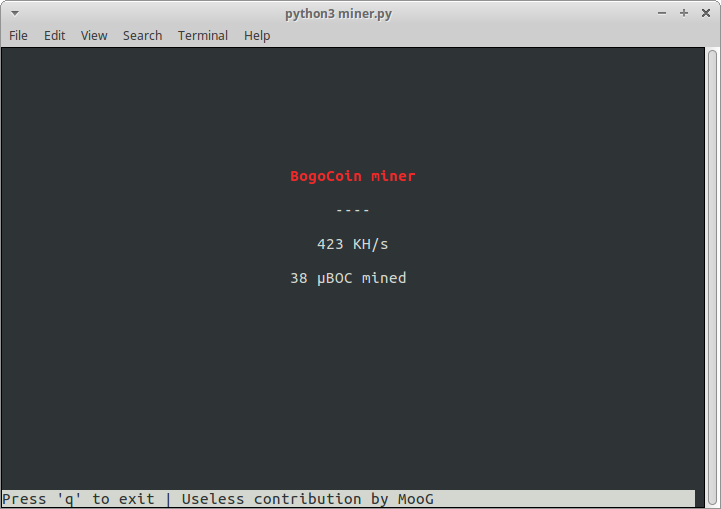

# TG2018 useless contribution

Crypto currency mining simulator. This is the tool for you who want to know what it feels like
to mine cryptocurrency, but don't dare to try the real thing. 



## Requirements
* Python 3
* libncurses-python
* Free CPU cycles

## Getting started
```
$ python3 miner.py
```